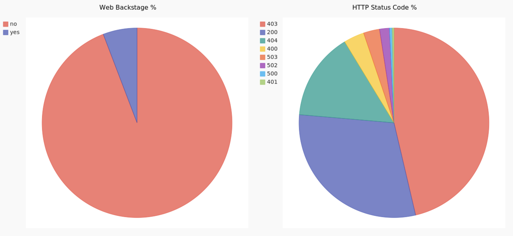
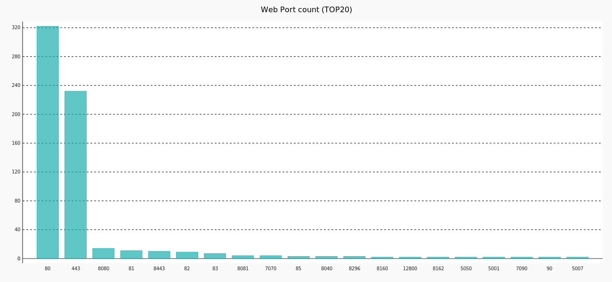
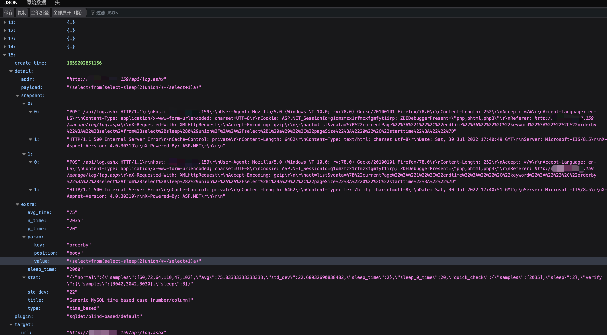

# IPWarden

在开始使用之前，请务必阅读并同意[免责声明](Disclaimer.md)中的条款，否则请勿下载使用本工具。

下载地址:https://github.com/EnnioX/IPWarden/releases/tag/IPWarden

## 简介

IPWarden是一个IP资产风险发现工具，可循环扫描IP资产，具有实效性地发现安全风险。在主机、端口、协议发现与风险端口管理的基础上：1）探测未授权访问服务漏洞；2）探测Web资产并对Web资产开展xray融合rad漏洞扫描、组件指纹扫描(TideFinger)、管理后台识别、CMS识别、ssl证书信息收集。特点：通过IP一条龙挖掘系统服务、Web两个维度的信息、风险及漏洞。所有扫描结果循环更新并可通过API请求返回json数据和导出xlsx表格，方便二次开发与数据加工。适合甲方安全人员监控与管理公网/内网IP资产风险暴露面。

PS:Warden是War3中英雄守望者的英文名，好久没玩魔兽了==

## 功能

1. 主机、端口、协议发现
2. 未授权访问服务漏洞扫描(POC持续更新)
3. Web站点探测
4. xray融合rad漏洞扫描
5. Web组件指纹信息收集
6. Web CMS识别
7. Web管理后台识别
8. SSL证书信息扫描
9. 首页汇总数据生成统计图
10. 数据汇总xlsx文件导出(xray扫描信息只导出基本字段信息到表格，更多漏洞详情与请求响应包可通过API查询)

## 首页截图

1 .端口与协议发现
   
   
2 .风险端口与协议发现
   
   
3 .Web指纹收集
   
4 .Web后台站点占比与全部站点响应码占比
   
5 .开放Web服务端口统计
   
6 .xray扫描规则统计
   
7 .Web ssl证书扫描
   

## API清单

| 序号 | Api用途                  | 方法 | url                           | 请求参数 | 返回字段                                                                                                                                                           | 返回格式 |
| ---- | ------------------------ | ---- | ----------------------------- | -------- | ------------------------------------------------------------------------------------------------------------------------------------------------------------------ | -------- |
| 1    | 查询全部IP开放端口数据   | GET  | http://127.0.0.1/portsdata    | 无       | ip : ip地址<br />port : 端口<br />protocol : 端口协议<br />updatetime : 扫描更新时间                                                                               | json     |
| 2    | 查询指定ip开放的端口     | GET  | http://127.0.0.1/ip=10.0.0.1  | ip       | port : 端口<br />protocol : 端口协议<br />updatetime : 扫描更新时间                                                                                                | json     |
| 3    | 查询开放指定端口的ip     | GET  | http://127.0.0.1/port=22      | port     | ip : ip地址<br />updatetime : 扫描更新时间                                                                                                                         | json     |
| 4    | 查询全部风险端口数据     | GET  | http://127.0.0.1/riskports    | 无       | 同序号1                                                                                                                                                            | json     |
| 5    | 查询白名单外风险端口数据 | GET  | http://127.0.0.1/newriskports | 无       | 同序号1                                                                                                                                                            | json     |
| 6    | 查询SSL证书数据          | GET  | http://127.0.0.1/ssl          | 无       | ip : ip地址<br />url : 访问地址<br />common_name : ssl证书名称<br />start_date : ssl证书开始日期<br />expire_date : ssl证书结束日期<br />updatetime : 扫描更新时间 | json     |
| 7    | Web站点探测              | GET  | http://127.0.0.1/web          | 无       | ip : ip地址<br />port : 端口<br />url : 访问地址<br />title : 网站标题<br />backstage : yes代表识别为web管理后台，否则为no<br />updatetime : 扫描更新时间          | json     |
| 8    | Web Finger信息           | GET  | http://127.0.0.1/webfinger    | 无       | url : 访问地址<br />title : 网站标题<br />webfinger : web指纹资产<br />updatetime : 扫描更新时间                                                                   | json     |
| 9    | Web管理后台站点探测      | GET  | http://127.0.0.1/backstage    | 无       | 同序号7                                                                                                                                                            | json     |
| 10   | Xray+rad扫描                 | GET  | http://127.0.0.1/xray         | 无       | 太多辣～ 参考xray指南                                | json     |
| 11   | Web cms信息              | GET  | http://127.0.0.1/cms          | 无       | url : 访问地址<br />cms : 识别到的web cms<br />title : 网站标题<br />updatetime : 扫描更新时间                                                                     | json     |
| 12   | 未授权访问服务漏洞      | GET  | http://127.0.0.1/portvuln     | 无       | ip : ip地址<br />port : 端口<br />vuln : 漏洞名称<br />detail : 漏洞详情<br />updatetime : 扫描更新时间                                                            | json     |
| 13   | 下载xlsx                 | GET  | http://127.0.0.1/xlsx         | 无       |                                                                                                                                                                    | xlsx     |

## API返回示例
### 端口服务未授权访问漏洞（http://127.0.0.1/portvuln）

```
[
   {
      "ip": "192.168.1.161"
      "port": "2049"
      "vuln": "nfs unauth vuln"
      "detail": "-"
      "updatetime": "2022-07-13 13:13:58"
   }
   {
      "ip": "192.168.1.162"
      "port": "8010"
      "vuln": "druid unauth vuln"
      "detail": "http://114.132.252.198:8010/druid/index.html"
      "updatetime": "2022-07-13 13:13:58"
   }
]
```

### Web站点探测（http://127.0.0.1/web）

```
[
   {
      "ip": "192.168.1.1"
      "port": "7070"
      "url": "https://192.168.0.1:7070/"
      "title": "巧克力真好吃"
      "backstage": "no"
      "updatetime": "2022-07-13 13:13:58"
   }
   {
      "ip": "192.168.1.2"
      "port": "80"
      "url": "http://example.com/"
      "title": "XXX管理后台"
      "backstage": "yes"  # 值为yes代表识别为管理后台
      "updatetime": "2022-07-13 13:13:58"
   }
]
```

### xray扫描（http://127.0.0.1/xray）


## 部署方式

### 部署前环境准备

1 .centos7

2 .python3

3 .mysql或mariadb数据库(字符集:utf8mb4,数据库可不在本地)

### 部署过程

1 .在IPWarden文件夹路径下执行如下命令安装cairo、chrome、nfs库和导入依赖,可一键复制运行

```
yum install glib-devel -y
yum install atk-devel -y
yum install pango-devel -y
yum install cairo-devel -y

yum install nfs-utils -y

wget https://dl.google.com/linux/direct/google-chrome-stable_current_x86_64.rpm
yum update glib2 -y
yum localinstall google-chrome-stable_current_x86_64.rpm -y

pip3 install --upgrade pip -i http://pypi.douban.com/simple --trusted-host pypi.douban.com
pip3 install -r requirements.txt  -i https://pypi.douban.com/simple/ --trusted-host pypi.douban.com

```

2 .如果使用root账号运行，需要允许root使用chrome沙箱，做如下修改
```
vim /usr/bin/google-chrome
找到 exec -a "$0" "$HERE/chrome" "$@" 将其注释掉
并添加一行 exec -a "$0" "$HERE/chrome" "$@" --user-data-dir --no-sandbox
```

3 .填写配置文件:进入IPWarden目录，2个配置文件说明如下：大多数参数可使用默认，重点为scanConfig.py和scanConfig.py中要扫描的目标IP
```
serverConfig.py: 设置系统服务端口和数据库连接参数（一般第一次设置好后不会变动）
scanConfig.py: 设置扫描参数的scanConfig.py
```
如后续更改scanConfig.py配置，无需重启服务，下一扫描周期自动应用。更改serverConfig.py需要重新启动。

serverConfig.py

```
# 系统基础参数
API_PORT = 80  # 首页、api服务端口

# mysql配置
MYSQL_HOST = ''  # 要连接的数据库地址
MYSQL_PORT = 3306  # 数据库端口
MYSQL_USER = 'root'  # 数据库用户名
MYSQL_PASSWORD = 'password'  # 数据库连接密码
MYSQL_DATABASE = ''  # 库名
```

scanConfig.py

```
# masscan参数
SCAN_IP = '192.168.1.1,10.0.8.0/24,10.0.1.110-10.0.1.150'  # 选择扫描的目标IP，同masscan参数格式
SCAN_PORT = '1-10000,11211,27017,27018,50000,50070,50030'  # 设置扫描的端口范围，同masscan参数格式，可暴力设置1-65535
RATE = '10000'  # 扫描线程，如果扫描公网IP，建议使用有独立公网IP的云服务器或者调低masscan扫描线程小于4000
SCAN_WHITE_LIST = ''  # 不扫描的ip白名单，同masscan参数格式

# 要进行Web探测的端口
WEB_PORT = ['1-10000']  # 按需设置，可暴力设置1-65535

# Web管理后台关键词
WEB_BACKSTAGE = ['login', 'admin', '登录', '管理后台', '系统后台', '管理系统']

# 风险端口白名单,使用序号5api请求返回数据不包含以下数据，序号4api返回包括白名单内风险端口
RISK_PORT_WHITE_LIST = [['192.168.86.14', '3306'],['192.168.86.13', '22']]

# 选择是否要对发现的web页面xray联动rad扫描，1代表执行扫描，0为不扫描
XRAY_RAD = 1

# 自定义风险端口
RISK_PORT_LIST = ['21','22','3389'...]  # 可采用配置文件中默认数据
```

4 .赋予IPWarden文件夹及子文件执行权限，在文件夹路径下执行如下命令后台执行runIPWarden.py开始循环监控（不要重定向日志）

```
nohup python3 runIPWarden.py &
```

停止服务: 在IPWarden文件夹路径下执行如下命令停止运行

```
./kill.sh
```

服务启动后，默认循环启动所有扫描，就可以坐等通过api收集数据和看首页统计图了。如果目标ip数较多，每轮扫描的时间会比较长，发现web多的话xray扫描也会比较耗时，可选择自定义是否调用xray扫描模块。

## 写在最后

如有BUG或建议，欢迎向作者反馈～（vx:Ennio404）

