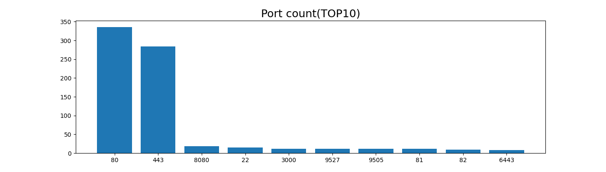
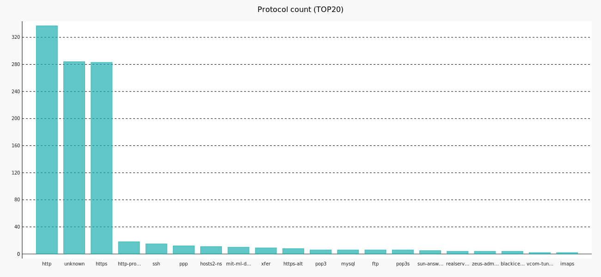
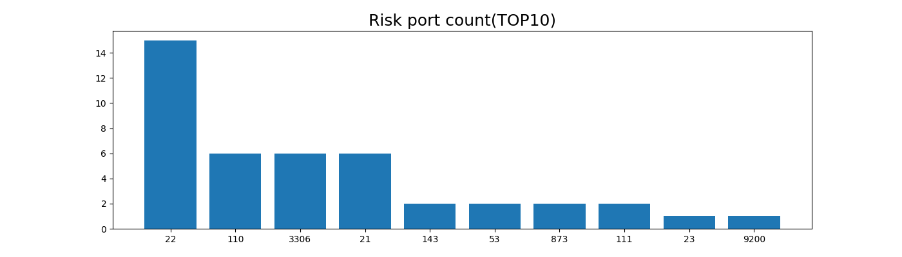
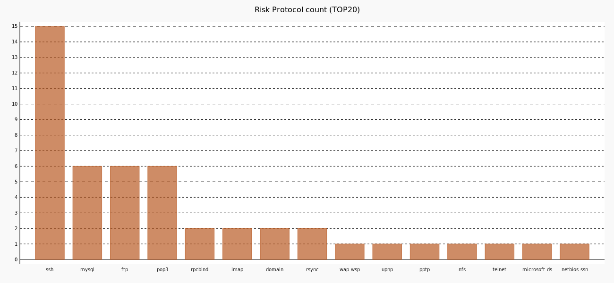
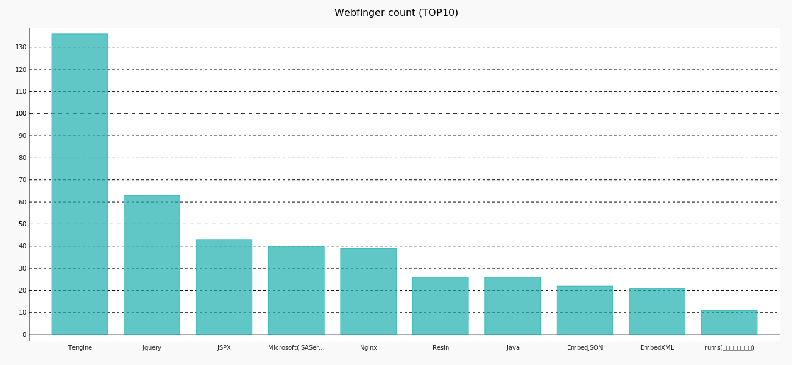
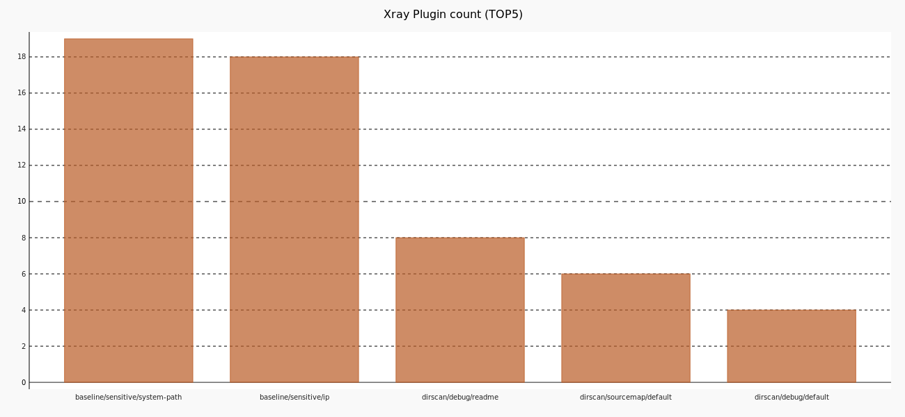
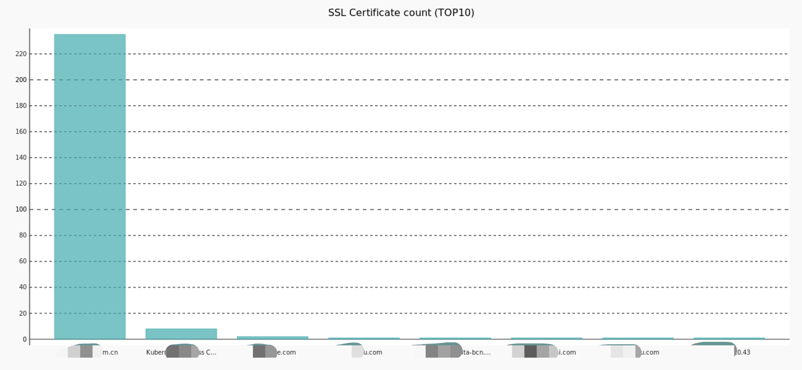

# IPWarden

在开始使用之前，请务必阅读并同意[免责声明](Disclaimer.md)中的条款，否则请勿下载使用本工具。

## 简介

IPWarden是一个IP资产风险发现工具，确定目标IP/网段后即可循环扫描更新结果，扫描产生的数据结果均可通过API获取，方便调用与加工。适合甲方安全人员管理公网/内网资产安全风险暴露面，渗透测试人员用于信息收集和攻击面探测

工作与学习中接触过一些不错的开源安全工具，使用过程中想如果数据结果可以方便脚本调用做二次处理就更好了，所以开发了这个通过调用api返回json格式数据结果的IP资产风险发现工具，方便甲方安全人员在扫描结果基础上灵活开发新功能，例如：风险资产新发现告警，自动化端口安全测试，ssl证书配置监控等。PS:Warden是War3中的英雄守望者的英文名，纪念一下沉迷魔兽的小学年代

## 功能

1. 主机、端口发现与风险端口整理
2. 端口协议识别
3. Web站点发现
4. Web指纹信息收集(集成TideFinger)
5. Web管理后台识别
6. Xray漏洞扫描
7. SSL证书信息扫描
8. 主页汇总数据生成柱状统计图

## API


| 序号 | Api用途                  | 方法 | url                               | 请求参数     | 返回字段                                                  | 返回格式 |
| ---- | ------------------------ | ---- | --------------------------------- | ------------ | --------------------------------------------------------- | -------- |
| 1    | 查询全部IP开放端口数据   | GET  | http://172.16.98.138/portsdata    | 无           | ip, port, protocol, updatetime                            | json     |
| 2    | 查询指定ip开放的端口     | GET  | http://172.16.98.138/ip=?         | ip(string)   | port, protocol, updatetime                                | json     |
| 3    | 查询开放指定端口的ip     | GET  | http://172.16.98.138/port=?       | port(string) | ip, updatetime                                            | json     |
| 4    | 查询全部风险端口数据     | GET  | http://172.16.98.138/riskports    | 无           | 同序号1                                                   | json     |
| 5    | 查询白名单外风险端口数据 | GET  | http://172.16.98.138/newriskports | 无           | 同序号1                                                   | json     |
| 6    | 查询SSL证书数据          | GET  | http://172.16.98.138/ssl          | 无           | ip, url, common_name, start_date, expire_date, updatetime | json     |
| 7    | Web站点探测              | GET  | http://172.16.98.138/web          | 无           | ip, url, title, backstage, updatetime                     | json     |
| 8    | Web Finger信息           | GET  | http://172.16.98.138/webfinger    | 无           | url, title, webfinger, updatetime                         | json     |
| 9    | Web管理后台站点探测      | GET  | http://172.16.98.138/backstage    | 无           | 同序号7                                                   | json     |
| 10   | Xray扫描                 | GET  | http://172.16.98.138/xray         | 无           | url, payload, plugin, request, updatetime                 | json     |

### API返回参数说明
```
ip:ip地址(str)
port:端口(str)
protocol:端口协议(str)
url:访问地址(str)
common_name:ssl证书名称(str)
start_date:ssl证书开始日期(str)
expire_date:ssl证书结束日期(str)
title:网站标题(str)
backstage:如果值为1识别为web管理后台，否则为0(int)
webfinger:web指纹资产,如"nginx"(str)
payload:xray扫描poc(str)
plugin:xray扫描规则(str)
request:xray扫描http请求(str)
updatetime:扫描更新时间(str)
```

### Web站点探测API返回参数示例
```
[
   {
      "ip": "192.168.1.1"
      "url": "http://192.168.0.1:7070/"
      "title": "巧克力真好吃"
      "backstage": 0
      "updatetime": "2022-07-13 13:13:58"
   }
   {
      "ip": "192.168.1.2"
      "url": "http://example.com/"
      "title": "XXX管理后台"
      "backstage": 1。# 值为1代表识别为管理后台
      "updatetime": "2022-07-13 13:13:58"
   }
]
```

## 主页截图

1 . 端口与协议发现TOP10
   
   
2 .风险端口与协议发现TOP10
   
   
3 . web指纹收集TOP10
   
4 . xray扫描规则统计TOP10
   
5 . web ssl证书扫描TOP10
   

## 部署方式
### 部署前环境准备(Centos7)
1 .python3

2 .mysql或mariadb，新建一个数据库，选择utf-8编码

注意；如果扫描公网IP，注意不要在需要SNAT方式访问公网的服务器上部署，masscan扫描并发会影响出口网络
### 部署过程
1 .进入IPWarden路径下进行配置文件修改，工具有2个配置文件，为设置系统服务与数据库连接的serverConfig.py和设置扫描参数的scanConfig.py

serverConfig.py
```
# 系统基础参数
API_PORT = 80  # 设置为你希望开放的服务端口
# mysql配置
MYSQL_HOST = '127.0.0.1'  # 此处修改为你的数据库IP地址
MYSQL_PORT = 3306  # 此处修改为数据库端口
MYSQL_USER = 'root'  # 数据库连接用户名
MYSQL_PASSWORD = 'password'  # 数据库连接密码
MYSQL_DATABASE = 'IPWarden'  # 库名
```
scanConfig.py
```
# masscan参数
SCAN_IP = '192.168.1.1,10.0.8.0/24,10.0.1.110-10.0.1.150'  # 选择扫描的目标IP，同masscan参数格式
SCAN_PORT = '1-10000,11211,27017,27018,50000,50070,50030'  # 设置扫描的端口范围，同masscan参数格式，首次扫描建议使用默认参数，后期可以改为1-65535
RATE = '5000'  # 扫描线程
SCAN_WHITE_LIST = '192.168.3.4'  # 不扫描的ip白名单,格式同SCAN_IP
# 定义Web端口
WEB_PORT = ['80-90', '443', '3000-4000', '7000-10000']
# Web管理后台关键词
WEB_BACKSTAGE = ['login', 'admin', '登录', '管理后台', '系统后台', '管理系统']
# 风险端口白名单,配置例外,使用序号5api请求返回数据不包含以下ip:端口
RISK_PORT_WHITE_LIST = [
    ['192.25.86.1x', '3306'],
    ['192.25.86.13x', '22'],
]
# 定义风险端口
RISK_PORT_LIST = ['21','22','3389'...]  # 可采用配置文件中默认数据
```
2 .配置文件修改好后，进入IPWarden文件夹路径下使用如下命令后台执行runIPWarden.py开始循环监控

runIPWarden.py自带导入python依赖，如果导入出错建议更新pip3
```
nohup python3 runIPWarden.py &
```
服务启动后，可通过 "http://ip:port" (配置文件默认80端口)访问主页，如果目标ip较多，第一次执行可能会持续数个小时结束第一轮才有数据可以访问，建议大半天再回来看结果，后续循环扫描可以不用管让它自己更新页面，更改配置文件需要重新执行如上命令重启

3 .停止服务，使用如下命令执行IPWarden路径下kill.sh文件
```
./kill.sh
```
## 使用反馈
使用过程中如有疑问或建议，欢迎添加开发者微信交流:Ennio404

