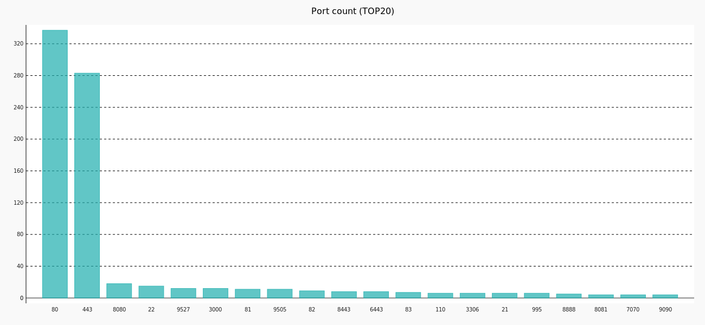

# IPWarden

在开始使用之前，请务必阅读并同意[免责声明](Disclaimer.md)中的条款，否则请勿下载使用本工具。

下载地址:https://github.com/EnnioX/IPWarden/releases/tag/IPWarden

## 简介

IPWarden（守望者）是一个IP资产风险巡查工具。持续发现系统、Web两个维度的资产和安全风险。所有扫描结果可通过API访问json数据，方便二次开发或数据整理。适合甲方安全人员用于监控管理公网/内网IP资产风险暴露面。

使用方式：输入监控IP范围，扫描模块按顺序自动化完成，通过API读取数据

开发目的：做安全运营工作时，用不同工具获取，整理数据比较繁琐，通过此工具可将安全工作自动化。用API的方式将数据用于自动生成告警、日周月报、与其它部门对接等。（集成了nmap、masscan、TideFinger、nuclei、xray、rad等安全工具）

## 功能

1. 主机、端口、协议发现
2. 风险端口管理
3. 未授权访问服务漏洞扫描
4. Web站点探测
5. Web管理后台识别
6. xray融合rad漏洞扫描
7. nuclei漏洞扫描
8. Web组件指纹信息收集
9. Web CMS识别
10. SSL证书信息扫描
11. 首页汇总数据生成统计图

## 首页截图

1 .端口与协议发现
   
   
2 .风险端口与协议发现
   
   
3 .开放Web服务端口统计
   
4 .Web后台发现比例图、HTTP响应码比例图
   
5 .Web组件指纹收集
   
6 .Web ssl证书扫描
   

## API清单

| 序号 | Api用途                  | 方法 | url                                | 请求参数 | 返回字段                                                                                                                                                           | 返回格式 |
| ---- | ------------------------ | ---- | ---------------------------------- | -------- | ------------------------------------------------------------------------------------------------------------------------------------------------------------------ | -------- |
| 1    | 查询全部IP开放端口数据   | GET  | http://127.0.0.1:8088/portsdata    | 无       | ip : ip地址<br />port : 端口<br />protocol : 端口协议<br />updatetime : 扫描更新时间                                                                               | json     |
| 2    | 查询指定ip开放的端口     | GET  | http://127.0.0.1:8088/ip=10.0.0.1  | ip       | port : 端口<br />protocol : 端口协议<br />updatetime : 扫描更新时间                                                                                                | json     |
| 3    | 查询开放指定端口的ip     | GET  | http://127.0.0.1:8088/port=22      | port     | ip : ip地址<br />updatetime : 扫描更新时间                                                                                                                         | json     |
| 4    | 查询全部风险端口数据     | GET  | http://127.0.0.1:8088/riskports    | 无       | 同序号1                                                                                                                                                            | json     |
| 5    | 查询白名单外风险端口数据 | GET  | http://127.0.0.1:8088/newriskports | 无       | 同序号1                                                                                                                                                            | json     |
| 6    | 查询SSL证书数据          | GET  | http://127.0.0.1:8088/ssl          | 无       | ip : ip地址<br />url : 访问地址<br />common_name : ssl证书名称<br />start_date : ssl证书开始日期<br />expire_date : ssl证书结束日期<br />updatetime : 扫描更新时间 | json     |
| 7    | Web站点探测              | GET  | http://127.0.0.1:8088/web          | 无       | ip : ip地址<br />port : 端口<br />url : 访问地址<br />title : 网站标题<br />backstage : yes代表识别为web管理后台，否则为no<br />updatetime : 扫描更新时间          | json     |
| 8    | Web Finger信息           | GET  | http://127.0.0.1:8088/webfinger    | 无       | url : 访问地址<br />title : 网站标题<br />webfinger : web指纹资产<br />updatetime : 扫描更新时间                                                                   | json     |
| 9    | Web管理后台站点探测      | GET  | http://127.0.0.1:8088/backstage    | 无       | 同序号7                                                                                                                                                            | json     |
| 10   | xray+rad漏洞扫描         | GET  | http://127.0.0.1:8088/xray         | 无       | 参考xray指南                                                                                                                                                       | json     |
| 11   | nuclei漏洞扫描           | GET  | http://127.0.0.1:8088/nuclei       | 无       | nuclei : 漏洞详情                                                                                                                                                 | json     |
| 12   | 未授权访问服务漏洞       | GET  | http://127.0.0.1:8088/portvuln     | 无       | ip : ip地址<br />port : 端口<br />vuln : 漏洞名称<br />detail : 漏洞详情<br />updatetime : 扫描更新时间                                                            | json     |
| 13   | Web cms信息              | GET  | http://127.0.0.1:8088/cms          | 无       | url : 访问地址<br />cms : 识别到的web cms<br />title : 网站标题<br />updatetime : 扫描更新时间                                                                     | json     |

## API返回示例

### 端口服务未授权访问漏洞（http://127.0.0.1:8088/portvuln）

```
[
   {
      "ip": "192.168.1.161"
      "port": "2049"
      "vuln": "nfs unauth vuln"
      "detail": "-"
      "updatetime": "2022-07-13 13:13:58"
   }
   {
      "ip": "192.168.1.162"
      "port": "8010"
      "vuln": "druid unauth vuln"
      "detail": "http://114.132.252.198:8010/druid/index.html"
      "updatetime": "2022-07-13 13:13:58"
   }
]
```

### Web站点探测（http://127.0.0.1:8088/web）

```
[
   {
      "ip": "192.168.1.1"
      "port": "7070"
      "url": "https://192.168.0.1:7070/"
      "title": "巧克力真好吃"
      "backstage": "no"
      "updatetime": "2022-07-13 13:13:58"
   }
   {
      "ip": "192.168.1.2"
      "port": "80"
      "url": "http://example.com/"
      "title": "XXX管理后台"
      "backstage": "yes"  # 值为yes代表识别为管理后台
      "updatetime": "2022-07-13 13:13:58"
   }
]
```

### xray扫描（http://127.0.0.1:8088/xray）


### nuclei扫描（http://127.0.0.1:8088/nuclei）


## 部署方式

### 部署前环境准备

1 .Linux环境（示例为CentOS7）

2 .python3

3 .mysql或mariadb数据库(字符集:utf8mb4, 可连接远程数据库)

### 部署过程

1 .在IPWarden文件夹路径下执行如下命令安装cairo、chrome、nfs库和导入依赖,一键复制运行

```
yum install glib-devel -y
yum install atk-devel -y
yum install pango-devel -y
yum install cairo-devel -y

yum install nfs-utils -y

wget https://dl.google.com/linux/direct/google-chrome-stable_current_x86_64.rpm
yum update glib2 -y
yum localinstall google-chrome-stable_current_x86_64.rpm -y

pip3 install --upgrade pip -i http://pypi.douban.com/simple --trusted-host pypi.douban.com
pip3 install -r requirements.txt  -i https://pypi.douban.com/simple/ --trusted-host pypi.douban.com
pwd

```

2 .如果使用root账号运行本工具，需要允许root使用chrome沙箱，做如下修改（非root权限运行可跳过此步骤）

```
vim /usr/bin/google-chrome
找到 exec -a "$0" "$HERE/chrome" "$@" 将其注释掉
并添加一行 exec -a "$0" "$HERE/chrome" "$@" --user-data-dir --no-sandbox
```

3 .编辑配置文件config.py : 进入IPWarden目录，绝大多数参数可使用默认，以下为必选配置参数（更改配置文件内容无需重启脚本，下一扫描周期自动应用）

```
# mysql配置
MYSQL_HOST = ''  # 要连接的数据库地址
MYSQL_PORT = 3306  # 数据库端口
MYSQL_USER = 'root'  # 数据库用户名
MYSQL_PASSWORD = 'password'  # 数据库连接密码
MYSQL_DATABASE = ''  # 库名

# masscan参数
SCAN_IP = '10.0.0.1-10.0.0.100,192.168.1.0/24,192.168.2.1'  # 选择扫描的目标IP，同masscan参数格式
```

4 .赋予IPWarden文件夹及子文件执行权限，在文件夹路径下执行如下命令后台执行runIPWarden.py开始循环监控（不要重定向日志）

```
nohup python3 runIPWarden.py &
```

停止服务: 在IPWarden文件夹路径下执行如下命令停止运行

```
./kill.sh
```

服务启动后，默认循环启动所有扫描，就可以坐等通过API收集数据和看首页统计图了，服务端口为8088。一个有较多web服务的C段地址1个扫描周期为半天左右。

## 写在最后

保佑过年前不得新冠
